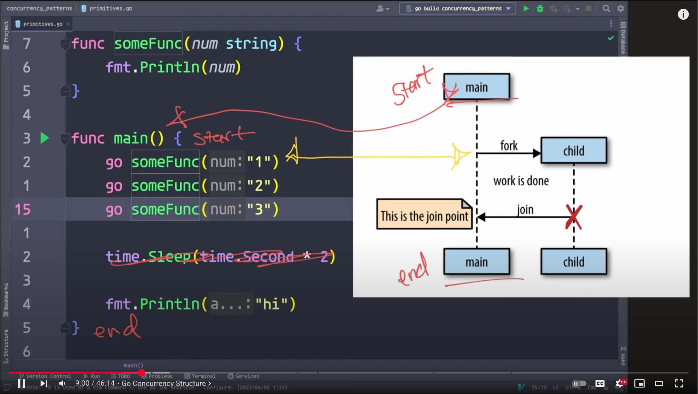

# Go Interview

	
	 
	<b>
		#goroutines &nbsp; #channels &nbsp; #concurrency &nbsp; #pipeline &nbsp; #context &nbsp; #timer
	</b>

## Important Notes

- Go’s concurrency model is based on goroutines and channels—master these for idiomatic Go.
- Always use context for cancellation, timeouts, and deadlines in concurrent code.
- Avoid sharing mutable state; prefer communication over channels.
- Use WaitGroups, errgroup, and select for robust coordination and error handling.
- Read the official Go blog and Rob Pike’s talks for deep insights.

### Go Routines

## Common pitfalls & best practices

- Goroutine leaks: always have a way to stop goroutines—propagate ctx, close input channels, or use done signals. Pipelines must stop downstream stages on cancellation.

- Range-and-close: a receiver can range a channel until the sender closes it; don’t send after closing.

- Backpressure: pick buffer sizes intentionally; use semaphores to bound concurrency.
  CloudBees

- Timeouts: prefer context.WithTimeout over sprinkled time.After in every select, to centralize control and avoid leaks.

- Select fairness: selection among ready cases is pseudo-random; don’t rely on case ordering for fairness.

- Don’t fight the model: communicate by channels; share memory via synchronization when that’s simpler. Rob Pike’s talks & Go blog are gold.
